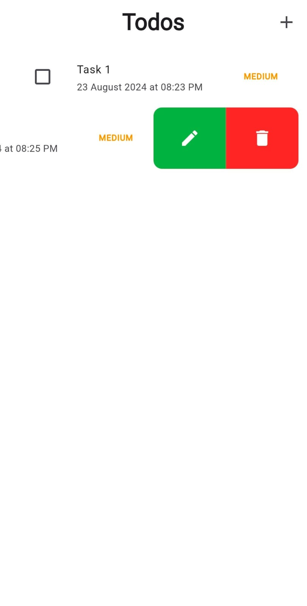

# TaskNest

## Overview

This Flutter application is a comprehensive ToDo list manager that includes features for adding, editing, and managing tasks. It provides functionalities such as task reminders via local notifications and integrates with a backend to handle task data. This README will guide you through the setup, features, and usage of the application.

## Features

- **Task Management**: Add, edit, and delete tasks.
- **Due Date and Time**: Set and manage due dates and times for tasks.
- **Local Notifications**: Receive instant and scheduled reminders for tasks.
- **Task Priority**: Set and view tasks with different priority levels (High, Medium, Low).
- **UI Enhancements**: Modern and user-friendly interface with smooth navigation.

## Technologies Used

- **Flutter**: Framework for building the mobile application.
- **Dart**: Programming language used with Flutter.
- **Bloc**: State management solution for handling application state.
- **Flutter Local Notifications**: Package for managing local notifications.
- **Timezone**: Package for handling time zone conversions.
- **Firebase**: Backend services (if used for authentication and data storage).

## Setup and Installation

1. **Clone the Repository**

   ```bash
   git clone https://github.com/yourusername/todo-application.git
   cd todo-application

2. **Install Dependencies**

    Ensure you have Flutter installed. Run the following command to get the dependencies:
    flutter pub get
3. **Setup Notification Icons**

- **Android**: Place your notification icons in the `android/app/src/main/res/drawable` directory. Ensure they are named appropriately (e.g., `ic_notification.png`).

- **iOS**: Place your notification icons in the `ios/Runner/Assets.xcassets/AppIcon.appiconset` directory. Ensure they are properly named and configured.

4. **Configure Local Notifications**

    Ensure you have set up the `NotificationService` class correctly to initialize and handle notifications.

5. **Run the Application**

    flutter run

## Usage

1. **Adding Tasks**

1. Navigate to the "New Task" screen from the home page.
2. Enter the task description, select the due date and time, and set the priority.
3. Save the task to add it to the list.


2. **Managing Tasks**

- View tasks on the home page.
- Swipe left or right to edit or delete tasks.
- Tap on a task to view detailed information or make changes.



3. **Notifications**

- Instant notifications are triggered when tasks are added.
- Scheduled notifications will remind you of tasks based on the due date and time you set.


## Contributing

Feel free to submit issues or pull requests to help improve the application. Ensure that you follow the code style guidelines and write clear commit messages.

## License

This project is licensed under the MIT License. See the `LICENSE` file for details.
